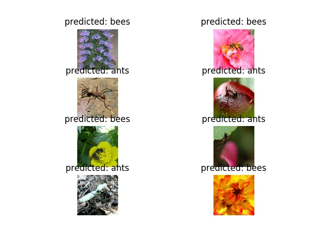
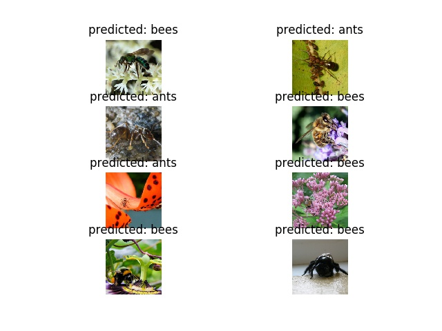

# transfer_learn

#### Description
impelement of transfer_learn
The problem we're going to solve today is to train a model to classify
**ants** and **bees**. We have about 120 training images each for ants and bees.
There are 75 validation images for each class. Usually, this is a very
small dataset to generalize upon, if trained from scratch. Since we
are using transfer learning, we should be able to generalize reasonably
well.

## dataset

This dataset is a very small subset of imagenet.
Download the data from  

`here <https://download.pytorch.org/tutorial/hymenoptera_data.zip>`  

and extract it to the current directory.


```shell
unzip hymenoptera_data.zip
```

dataset folder stracture

```shell
./data/hymenoptera_data/
                     ->train/
                           ->ants/
                                ->*.jpg
                           ->bees/
                                ->*.jpg
                     ->val/
                            ->ants/
                                ->*.jpg
                            ->bees/
                                ->*.jpg
```


Data augmentation and normalization for training  
Just normalization for validation  

how to run
```shell
bash run.sh
```

24epoch finetune output  



```shell
run the model with finetune=True
config:
std : [0.229, 0.224, 0.225]
dataset : hymenoptera_data
finetune : True
train_load_check_point_file : True
image_size : 224
num_workers : 4
device : cuda:0
epochs : 25
step_size : 7
resize : 256
momentum : 0.9
mean : [0.485, 0.456, 0.406]
batch_size : 8
gamma : 0.1
data_path : ./data/hymenoptera_data
learn_rate : 0.001
ResNet(
  (conv1): Conv2d(3, 64, kernel_size=(7, 7), stride=(2, 2), padding=(3, 3), bias=False)
  (bn1): BatchNorm2d(64, eps=1e-05, momentum=0.1, affine=True, track_running_stats=True)
  (relu): ReLU(inplace)
  (maxpool): MaxPool2d(kernel_size=3, stride=2, padding=1, dilation=1, ceil_mode=False)
  (layer1): Sequential(
    (0): BasicBlock(
      (conv1): Conv2d(64, 64, kernel_size=(3, 3), stride=(1, 1), padding=(1, 1), bias=False)
      (bn1): BatchNorm2d(64, eps=1e-05, momentum=0.1, affine=True, track_running_stats=True)
      (relu): ReLU(inplace)
      (conv2): Conv2d(64, 64, kernel_size=(3, 3), stride=(1, 1), padding=(1, 1), bias=False)
      (bn2): BatchNorm2d(64, eps=1e-05, momentum=0.1, affine=True, track_running_stats=True)
    )
    (1): BasicBlock(
      (conv1): Conv2d(64, 64, kernel_size=(3, 3), stride=(1, 1), padding=(1, 1), bias=False)
      (bn1): BatchNorm2d(64, eps=1e-05, momentum=0.1, affine=True, track_running_stats=True)
      (relu): ReLU(inplace)
      (conv2): Conv2d(64, 64, kernel_size=(3, 3), stride=(1, 1), padding=(1, 1), bias=False)
      (bn2): BatchNorm2d(64, eps=1e-05, momentum=0.1, affine=True, track_running_stats=True)
    )
  )
  (layer2): Sequential(
    (0): BasicBlock(
      (conv1): Conv2d(64, 128, kernel_size=(3, 3), stride=(2, 2), padding=(1, 1), bias=False)
      (bn1): BatchNorm2d(128, eps=1e-05, momentum=0.1, affine=True, track_running_stats=True)
      (relu): ReLU(inplace)
      (conv2): Conv2d(128, 128, kernel_size=(3, 3), stride=(1, 1), padding=(1, 1), bias=False)
      (bn2): BatchNorm2d(128, eps=1e-05, momentum=0.1, affine=True, track_running_stats=True)
      (downsample): Sequential(
        (0): Conv2d(64, 128, kernel_size=(1, 1), stride=(2, 2), bias=False)
        (1): BatchNorm2d(128, eps=1e-05, momentum=0.1, affine=True, track_running_stats=True)
      )
    )
    (1): BasicBlock(
      (conv1): Conv2d(128, 128, kernel_size=(3, 3), stride=(1, 1), padding=(1, 1), bias=False)
      (bn1): BatchNorm2d(128, eps=1e-05, momentum=0.1, affine=True, track_running_stats=True)
      (relu): ReLU(inplace)
      (conv2): Conv2d(128, 128, kernel_size=(3, 3), stride=(1, 1), padding=(1, 1), bias=False)
      (bn2): BatchNorm2d(128, eps=1e-05, momentum=0.1, affine=True, track_running_stats=True)
    )
  )
  (layer3): Sequential(
    (0): BasicBlock(
      (conv1): Conv2d(128, 256, kernel_size=(3, 3), stride=(2, 2), padding=(1, 1), bias=False)
      (bn1): BatchNorm2d(256, eps=1e-05, momentum=0.1, affine=True, track_running_stats=True)
      (relu): ReLU(inplace)
      (conv2): Conv2d(256, 256, kernel_size=(3, 3), stride=(1, 1), padding=(1, 1), bias=False)
      (bn2): BatchNorm2d(256, eps=1e-05, momentum=0.1, affine=True, track_running_stats=True)
      (downsample): Sequential(
        (0): Conv2d(128, 256, kernel_size=(1, 1), stride=(2, 2), bias=False)
        (1): BatchNorm2d(256, eps=1e-05, momentum=0.1, affine=True, track_running_stats=True)
      )
    )
    (1): BasicBlock(
      (conv1): Conv2d(256, 256, kernel_size=(3, 3), stride=(1, 1), padding=(1, 1), bias=False)
      (bn1): BatchNorm2d(256, eps=1e-05, momentum=0.1, affine=True, track_running_stats=True)
      (relu): ReLU(inplace)
      (conv2): Conv2d(256, 256, kernel_size=(3, 3), stride=(1, 1), padding=(1, 1), bias=False)
      (bn2): BatchNorm2d(256, eps=1e-05, momentum=0.1, affine=True, track_running_stats=True)
    )
  )
  (layer4): Sequential(
    (0): BasicBlock(
      (conv1): Conv2d(256, 512, kernel_size=(3, 3), stride=(2, 2), padding=(1, 1), bias=False)
      (bn1): BatchNorm2d(512, eps=1e-05, momentum=0.1, affine=True, track_running_stats=True)
      (relu): ReLU(inplace)
      (conv2): Conv2d(512, 512, kernel_size=(3, 3), stride=(1, 1), padding=(1, 1), bias=False)
      (bn2): BatchNorm2d(512, eps=1e-05, momentum=0.1, affine=True, track_running_stats=True)
      (downsample): Sequential(
        (0): Conv2d(256, 512, kernel_size=(1, 1), stride=(2, 2), bias=False)
        (1): BatchNorm2d(512, eps=1e-05, momentum=0.1, affine=True, track_running_stats=True)
      )
    )
    (1): BasicBlock(
      (conv1): Conv2d(512, 512, kernel_size=(3, 3), stride=(1, 1), padding=(1, 1), bias=False)
      (bn1): BatchNorm2d(512, eps=1e-05, momentum=0.1, affine=True, track_running_stats=True)
      (relu): ReLU(inplace)
      (conv2): Conv2d(512, 512, kernel_size=(3, 3), stride=(1, 1), padding=(1, 1), bias=False)
      (bn2): BatchNorm2d(512, eps=1e-05, momentum=0.1, affine=True, track_running_stats=True)
    )
  )
  (avgpool): AvgPool2d(kernel_size=7, stride=1, padding=0)
  (fc): Linear(in_features=512, out_features=2, bias=True)
)
[1/24] [Train Loss:0.5185 Acc:0.7213] [Val Loss:0.2674 Acc:0.9085] [Best Epoch:1 Acc:0.9085] [1.3285s 1.3285s]
[2/24] [Train Loss:0.3609 Acc:0.8361] [Val Loss:0.1733 Acc:0.9412] [Best Epoch:2 Acc:0.9412] [1.3079s 2.6365s]
[3/24] [Train Loss:0.2823 Acc:0.8934] [Val Loss:0.1625 Acc:0.9477] [Best Epoch:3 Acc:0.9477] [1.2812s 3.9176s]
[4/24] [Train Loss:0.1906 Acc:0.9262] [Val Loss:0.1639 Acc:0.9477] [Best Epoch:3 Acc:0.9477] [1.3068s 5.2244s]
[5/24] [Train Loss:0.2429 Acc:0.9057] [Val Loss:0.2559 Acc:0.9150] [Best Epoch:3 Acc:0.9477] [1.3273s 6.5517s]
[6/24] [Train Loss:0.2161 Acc:0.9057] [Val Loss:0.2018 Acc:0.9281] [Best Epoch:3 Acc:0.9477] [1.3289s 7.8806s]
[7/24] [Train Loss:0.2494 Acc:0.9139] [Val Loss:0.2553 Acc:0.9150] [Best Epoch:3 Acc:0.9477] [1.3054s 9.1860s]
[8/24] [Train Loss:0.1451 Acc:0.9508] [Val Loss:0.2175 Acc:0.9150] [Best Epoch:3 Acc:0.9477] [1.3425s 10.5285s]
[9/24] [Train Loss:0.1422 Acc:0.9590] [Val Loss:0.2163 Acc:0.9150] [Best Epoch:3 Acc:0.9477] [1.3253s 11.8538s]
[10/24] [Train Loss:0.1500 Acc:0.9467] [Val Loss:0.2364 Acc:0.9216] [Best Epoch:3 Acc:0.9477] [1.3283s 13.1821s]
[11/24] [Train Loss:0.1840 Acc:0.9221] [Val Loss:0.2118 Acc:0.9216] [Best Epoch:3 Acc:0.9477] [1.3313s 14.5134s]
[12/24] [Train Loss:0.1532 Acc:0.9426] [Val Loss:0.2108 Acc:0.9281] [Best Epoch:3 Acc:0.9477] [1.3792s 15.8925s]
[13/24] [Train Loss:0.1586 Acc:0.9303] [Val Loss:0.2082 Acc:0.9281] [Best Epoch:3 Acc:0.9477] [1.2652s 17.1577s]
[14/24] [Train Loss:0.1772 Acc:0.9262] [Val Loss:0.2242 Acc:0.9216] [Best Epoch:3 Acc:0.9477] [1.2985s 18.4562s]
[15/24] [Train Loss:0.1209 Acc:0.9672] [Val Loss:0.2173 Acc:0.9216] [Best Epoch:3 Acc:0.9477] [1.3271s 19.7833s]
[16/24] [Train Loss:0.1571 Acc:0.9426] [Val Loss:0.2082 Acc:0.9281] [Best Epoch:3 Acc:0.9477] [1.3196s 21.1029s]
[17/24] [Train Loss:0.2401 Acc:0.9016] [Val Loss:0.2140 Acc:0.9346] [Best Epoch:3 Acc:0.9477] [1.3619s 22.4648s]
[18/24] [Train Loss:0.1579 Acc:0.9467] [Val Loss:0.2133 Acc:0.9281] [Best Epoch:3 Acc:0.9477] [1.2715s 23.7362s]
[19/24] [Train Loss:0.1147 Acc:0.9631] [Val Loss:0.2195 Acc:0.9216] [Best Epoch:3 Acc:0.9477] [1.3313s 25.0675s]
[20/24] [Train Loss:0.1963 Acc:0.9098] [Val Loss:0.2144 Acc:0.9150] [Best Epoch:3 Acc:0.9477] [1.3578s 26.4253s]
[21/24] [Train Loss:0.1867 Acc:0.9221] [Val Loss:0.2094 Acc:0.9216] [Best Epoch:3 Acc:0.9477] [1.2682s 27.6935s]
[22/24] [Train Loss:0.1368 Acc:0.9467] [Val Loss:0.2142 Acc:0.9281] [Best Epoch:3 Acc:0.9477] [1.3807s 29.0742s]
[23/24] [Train Loss:0.1819 Acc:0.9221] [Val Loss:0.2000 Acc:0.9281] [Best Epoch:3 Acc:0.9477] [1.3199s 30.3941s]
[24/24] [Train Loss:0.1716 Acc:0.9303] [Val Loss:0.2122 Acc:0.9281] [Best Epoch:3 Acc:0.9477] [1.3263s 31.7204s]
```

24epoch without finetune output  



```shell
run the model with finetune=False
config:
std : [0.229, 0.224, 0.225]
dataset : hymenoptera_data
finetune : False
train_load_check_point_file : True
image_size : 224
num_workers : 4
device : cuda:0
epochs : 25
step_size : 7
resize : 256
momentum : 0.9
mean : [0.485, 0.456, 0.406]
batch_size : 8
gamma : 0.1
data_path : ./data/hymenoptera_data
learn_rate : 0.001
ResNet(
  (conv1): Conv2d(3, 64, kernel_size=(7, 7), stride=(2, 2), padding=(3, 3), bias=False)
  (bn1): BatchNorm2d(64, eps=1e-05, momentum=0.1, affine=True, track_running_stats=True)
  (relu): ReLU(inplace)
  (maxpool): MaxPool2d(kernel_size=3, stride=2, padding=1, dilation=1, ceil_mode=False)
  (layer1): Sequential(
    (0): BasicBlock(
      (conv1): Conv2d(64, 64, kernel_size=(3, 3), stride=(1, 1), padding=(1, 1), bias=False)
      (bn1): BatchNorm2d(64, eps=1e-05, momentum=0.1, affine=True, track_running_stats=True)
      (relu): ReLU(inplace)
      (conv2): Conv2d(64, 64, kernel_size=(3, 3), stride=(1, 1), padding=(1, 1), bias=False)
      (bn2): BatchNorm2d(64, eps=1e-05, momentum=0.1, affine=True, track_running_stats=True)
    )
    (1): BasicBlock(
      (conv1): Conv2d(64, 64, kernel_size=(3, 3), stride=(1, 1), padding=(1, 1), bias=False)
      (bn1): BatchNorm2d(64, eps=1e-05, momentum=0.1, affine=True, track_running_stats=True)
      (relu): ReLU(inplace)
      (conv2): Conv2d(64, 64, kernel_size=(3, 3), stride=(1, 1), padding=(1, 1), bias=False)
      (bn2): BatchNorm2d(64, eps=1e-05, momentum=0.1, affine=True, track_running_stats=True)
    )
  )
  (layer2): Sequential(
    (0): BasicBlock(
      (conv1): Conv2d(64, 128, kernel_size=(3, 3), stride=(2, 2), padding=(1, 1), bias=False)
      (bn1): BatchNorm2d(128, eps=1e-05, momentum=0.1, affine=True, track_running_stats=True)
      (relu): ReLU(inplace)
      (conv2): Conv2d(128, 128, kernel_size=(3, 3), stride=(1, 1), padding=(1, 1), bias=False)
      (bn2): BatchNorm2d(128, eps=1e-05, momentum=0.1, affine=True, track_running_stats=True)
      (downsample): Sequential(
        (0): Conv2d(64, 128, kernel_size=(1, 1), stride=(2, 2), bias=False)
        (1): BatchNorm2d(128, eps=1e-05, momentum=0.1, affine=True, track_running_stats=True)
      )
    )
    (1): BasicBlock(
      (conv1): Conv2d(128, 128, kernel_size=(3, 3), stride=(1, 1), padding=(1, 1), bias=False)
      (bn1): BatchNorm2d(128, eps=1e-05, momentum=0.1, affine=True, track_running_stats=True)
      (relu): ReLU(inplace)
      (conv2): Conv2d(128, 128, kernel_size=(3, 3), stride=(1, 1), padding=(1, 1), bias=False)
      (bn2): BatchNorm2d(128, eps=1e-05, momentum=0.1, affine=True, track_running_stats=True)
    )
  )
  (layer3): Sequential(
    (0): BasicBlock(
      (conv1): Conv2d(128, 256, kernel_size=(3, 3), stride=(2, 2), padding=(1, 1), bias=False)
      (bn1): BatchNorm2d(256, eps=1e-05, momentum=0.1, affine=True, track_running_stats=True)
      (relu): ReLU(inplace)
      (conv2): Conv2d(256, 256, kernel_size=(3, 3), stride=(1, 1), padding=(1, 1), bias=False)
      (bn2): BatchNorm2d(256, eps=1e-05, momentum=0.1, affine=True, track_running_stats=True)
      (downsample): Sequential(
        (0): Conv2d(128, 256, kernel_size=(1, 1), stride=(2, 2), bias=False)
        (1): BatchNorm2d(256, eps=1e-05, momentum=0.1, affine=True, track_running_stats=True)
      )
    )
    (1): BasicBlock(
      (conv1): Conv2d(256, 256, kernel_size=(3, 3), stride=(1, 1), padding=(1, 1), bias=False)
      (bn1): BatchNorm2d(256, eps=1e-05, momentum=0.1, affine=True, track_running_stats=True)
      (relu): ReLU(inplace)
      (conv2): Conv2d(256, 256, kernel_size=(3, 3), stride=(1, 1), padding=(1, 1), bias=False)
      (bn2): BatchNorm2d(256, eps=1e-05, momentum=0.1, affine=True, track_running_stats=True)
    )
  )
  (layer4): Sequential(
    (0): BasicBlock(
      (conv1): Conv2d(256, 512, kernel_size=(3, 3), stride=(2, 2), padding=(1, 1), bias=False)
      (bn1): BatchNorm2d(512, eps=1e-05, momentum=0.1, affine=True, track_running_stats=True)
      (relu): ReLU(inplace)
      (conv2): Conv2d(512, 512, kernel_size=(3, 3), stride=(1, 1), padding=(1, 1), bias=False)
      (bn2): BatchNorm2d(512, eps=1e-05, momentum=0.1, affine=True, track_running_stats=True)
      (downsample): Sequential(
        (0): Conv2d(256, 512, kernel_size=(1, 1), stride=(2, 2), bias=False)
        (1): BatchNorm2d(512, eps=1e-05, momentum=0.1, affine=True, track_running_stats=True)
      )
    )
    (1): BasicBlock(
      (conv1): Conv2d(512, 512, kernel_size=(3, 3), stride=(1, 1), padding=(1, 1), bias=False)
      (bn1): BatchNorm2d(512, eps=1e-05, momentum=0.1, affine=True, track_running_stats=True)
      (relu): ReLU(inplace)
      (conv2): Conv2d(512, 512, kernel_size=(3, 3), stride=(1, 1), padding=(1, 1), bias=False)
      (bn2): BatchNorm2d(512, eps=1e-05, momentum=0.1, affine=True, track_running_stats=True)
    )
  )
  (avgpool): AvgPool2d(kernel_size=7, stride=1, padding=0)
  (fc): Linear(in_features=512, out_features=2, bias=True)
)
[1/24] [Train Loss:0.5838 Acc:0.6393] [Val Loss:0.2962 Acc:0.9020] [Best Epoch:1 Acc:0.9020] [1.1856s 1.1856s]
[2/24] [Train Loss:0.3283 Acc:0.8934] [Val Loss:0.2175 Acc:0.9281] [Best Epoch:2 Acc:0.9281] [1.2195s 2.4051s]
[3/24] [Train Loss:0.3166 Acc:0.8566] [Val Loss:0.1928 Acc:0.9346] [Best Epoch:3 Acc:0.9346] [1.1106s 3.5157s]
[4/24] [Train Loss:0.2932 Acc:0.8975] [Val Loss:0.1743 Acc:0.9477] [Best Epoch:4 Acc:0.9477] [1.2303s 4.7460s]
[5/24] [Train Loss:0.3207 Acc:0.8320] [Val Loss:0.1753 Acc:0.9542] [Best Epoch:5 Acc:0.9542] [1.2099s 5.9559s]
[6/24] [Train Loss:0.2776 Acc:0.8770] [Val Loss:0.1751 Acc:0.9412] [Best Epoch:5 Acc:0.9542] [1.1920s 7.1479s]
[7/24] [Train Loss:0.2705 Acc:0.8811] [Val Loss:0.1822 Acc:0.9542] [Best Epoch:5 Acc:0.9542] [1.1728s 8.3207s]
[8/24] [Train Loss:0.1962 Acc:0.9180] [Val Loss:0.1821 Acc:0.9477] [Best Epoch:5 Acc:0.9542] [1.1578s 9.4785s]
[9/24] [Train Loss:0.1874 Acc:0.9221] [Val Loss:0.1754 Acc:0.9608] [Best Epoch:9 Acc:0.9608] [1.2263s 10.7048s]
[10/24] [Train Loss:0.1853 Acc:0.9221] [Val Loss:0.1743 Acc:0.9608] [Best Epoch:9 Acc:0.9608] [1.2255s 11.9303s]
[11/24] [Train Loss:0.2535 Acc:0.8852] [Val Loss:0.1808 Acc:0.9608] [Best Epoch:9 Acc:0.9608] [1.2431s 13.1734s]
[12/24] [Train Loss:0.2674 Acc:0.8893] [Val Loss:0.1741 Acc:0.9608] [Best Epoch:9 Acc:0.9608] [1.1599s 14.3333s]
[13/24] [Train Loss:0.2844 Acc:0.8893] [Val Loss:0.1766 Acc:0.9542] [Best Epoch:9 Acc:0.9608] [1.2288s 15.5621s]
[14/24] [Train Loss:0.1607 Acc:0.9467] [Val Loss:0.1908 Acc:0.9477] [Best Epoch:9 Acc:0.9608] [1.2446s 16.8068s]
[15/24] [Train Loss:0.1954 Acc:0.9303] [Val Loss:0.1785 Acc:0.9608] [Best Epoch:9 Acc:0.9608] [1.2252s 18.0319s]
[16/24] [Train Loss:0.2241 Acc:0.9016] [Val Loss:0.1734 Acc:0.9608] [Best Epoch:9 Acc:0.9608] [1.2243s 19.2562s]
[17/24] [Train Loss:0.2126 Acc:0.9098] [Val Loss:0.1827 Acc:0.9477] [Best Epoch:9 Acc:0.9608] [1.1610s 20.4172s]
[18/24] [Train Loss:0.1669 Acc:0.9303] [Val Loss:0.1779 Acc:0.9608] [Best Epoch:9 Acc:0.9608] [1.1824s 21.5996s]
[19/24] [Train Loss:0.2127 Acc:0.9180] [Val Loss:0.1720 Acc:0.9608] [Best Epoch:9 Acc:0.9608] [1.1214s 22.7209s]
[20/24] [Train Loss:0.2483 Acc:0.8975] [Val Loss:0.1696 Acc:0.9608] [Best Epoch:9 Acc:0.9608] [1.1469s 23.8678s]
[21/24] [Train Loss:0.2560 Acc:0.8852] [Val Loss:0.1639 Acc:0.9608] [Best Epoch:9 Acc:0.9608] [1.1381s 25.0059s]
[22/24] [Train Loss:0.2112 Acc:0.9180] [Val Loss:0.1777 Acc:0.9542] [Best Epoch:9 Acc:0.9608] [1.1740s 26.1799s]
[23/24] [Train Loss:0.2900 Acc:0.8852] [Val Loss:0.1691 Acc:0.9542] [Best Epoch:9 Acc:0.9608] [1.1615s 27.3414s]
[24/24] [Train Loss:0.2246 Acc:0.8975] [Val Loss:0.1746 Acc:0.9608] [Best Epoch:9 Acc:0.9608] [1.1800s 28.5213s]
```
